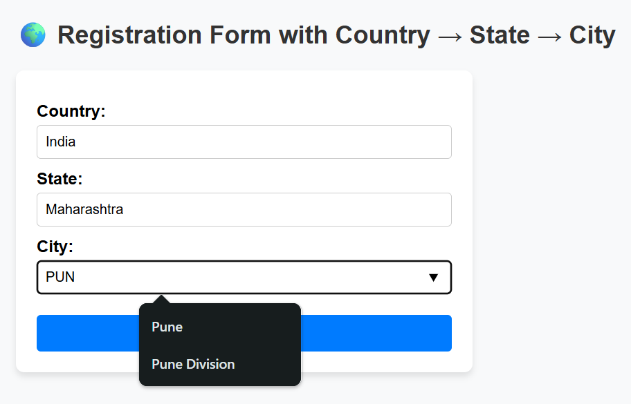

# 🌍 World Region Form

A simple and developer-friendly registration form that dynamically loads **Countries → States → Cities → Districts** using free public APIs.  
This project helps developers integrate location-based forms into their apps with ease.

---

## ✨ Features
- Fetch live country, state, and city data from a **public API**.
- Dropdowns update automatically based on user selections.
- Validation ensures users can only select from given options.
- Lightweight and easy to integrate in any project.

---

## 🚀 Getting Started

### 1️⃣ Clone the Repository
```bash
git clone https://github.com/your-username/world-region-form.git
cd world-region-form
2️⃣ Open in Browser
Simply open index.html in your browser and start testing.

3️⃣ Customize
You can modify CSS and add more fields as per your project’s requirement.

🛠️ Tech Stack
HTML5

CSS3

JavaScript (Vanilla)

Free Public API (countriesnow.space)

📸 Demo Screenshot


🤝 Contribution
We welcome contributions!

Fork the repo

Create your feature branch (git checkout -b feature-name)

Commit your changes (git commit -m "Add new feature")

Push to the branch (git push origin feature-name)

Open a Pull Request

📜 License & Copyright
© 2025 World Region Form Developers
This project is licensed under the MIT License.

You are free to use, modify, and distribute this project with proper attribution.
For commercial usage, please retain the original license notice.